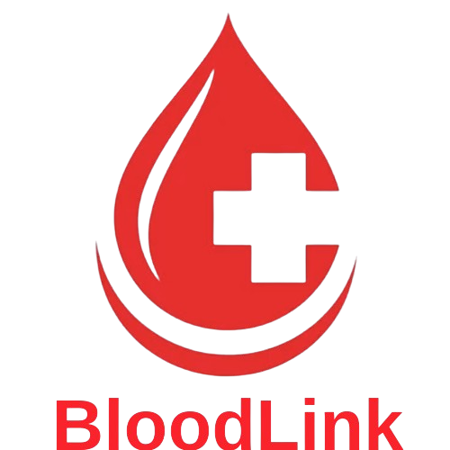

# 🩸 BloodLink

<div align="center">
  
  
  **Saving Lives Made Simple — Join or Find Donors Instantly**

   🌐 **Live Demo:** https://bloodlink-ssa.pages.dev/
  
  [](https://react.dev/)
  [](https://vitejs.dev/)
  [](https://tailwindcss.com/)
  [](https://firebase.google.com/)
</div>

---

## 📖 Overview

**BloodLink** is a modern blood donation management platform that connects blood donors with recipients quickly, reliably, and securely. The platform enables users to search for donors by blood group and location, create donation requests, and contribute through funding — all within an intuitive and responsive interface.

---

## ✨ Features

### 🔍 Donor Search
- Search donors by **blood group** (A+, A-, B+, B-, AB+, AB-, O+, O-)
- Filter by **district** and **upazila** (location-based)
- View donor profiles with contact information and status

### 📝 Donation Requests
- Create blood donation requests with detailed information
- Specify recipient details, hospital, address, and urgency
- Track request status (pending, inprogress, done, canceled)
- Edit and manage your donation requests

### 👤 User Dashboard
- Personal profile management
- View and manage your donation requests
- Track donation history

### 🔐 Authentication
- Secure user registration and login
- Firebase Authentication integration
- Protected routes for authenticated users

### 💳 Funding System
- Support the platform through donations
- Secure Stripe payment integration
- View funding history and contributions

### 👨‍💼 Admin Panel
- Manage all users (view, block/unblock)
- Oversee all donation requests
- Platform administration tools

---

## 🛠️ Tech Stack

| Category | Technologies |
|----------|-------------|
| **Frontend** | React 19, Vite, React Router 7 |
| **Styling** | TailwindCSS 4, DaisyUI 5, MUI |
| **Animation** | Framer Motion |
| **Forms** | React Hook Form, React Select |
| **Authentication** | Firebase Auth |
| **HTTP Client** | Axios |
| **Payments** | Stripe |
| **Email** | EmailJS |
| **UI Components** | Lucide React, React Icons, Swiper |
| **Notifications** | React Toastify, SweetAlert2 |

---

## 🚀 Getting Started

### Prerequisites

- Node.js (v18 or higher)
- npm or yarn
- Firebase project with Authentication enabled
- Stripe account (for payment features)

### Installation

1. **Clone the repository**
   ```bash
   git clone https://github.com/yourusername/bloodlink-client.git
   cd bloodlink-client
   ```

2. **Install dependencies**
   ```bash
   npm install
   ```

3. **Environment Setup**
   
   Create a `.env` file in the root directory:
   ```env
   VITE_FIREBASE_API_KEY=your_firebase_api_key
   VITE_FIREBASE_AUTH_DOMAIN=your_firebase_auth_domain
   VITE_FIREBASE_PROJECT_ID=your_firebase_project_id
   VITE_FIREBASE_STORAGE_BUCKET=your_firebase_storage_bucket
   VITE_FIREBASE_MESSAGING_SENDER_ID=your_firebase_messaging_sender_id
   VITE_FIREBASE_APP_ID=your_firebase_app_id
   VITE_API_URL=your_backend_api_url
   VITE_STRIPE_PUBLIC_KEY=your_stripe_public_key
   ```

4. **Start the development server**
   ```bash
   npm run dev
   ```

5. **Open your browser**
   
   Navigate to `http://localhost:5173`

---

## 📁 Project Structure

```
bloodlink-client/
├── public/
│   ├── location.json      # Districts & Upazilas data
│   └── _redirects          # Netlify redirects
├── src/
│   ├── assets/             # Images and static files
│   ├── context/            # React Context (Auth)
│   ├── dashboard/          # Dashboard components
│   │   ├── admin/          # Admin-specific pages
│   │   ├── Profile.jsx
│   │   ├── DashboardHome.jsx
│   │   ├── DonationRequests.jsx
│   │   └── ...
│   ├── firebase/           # Firebase configuration
│   ├── hooks/              # Custom React hooks
│   ├── layouts/            # Layout components
│   ├── loading/            # Loading components
│   ├── pages/              # Public pages
│   │   ├── auth/           # Login & Register
│   │   ├── home/           # Home page sections
│   │   └── shared/         # Navbar & Footer
│   ├── routes/             # Router configuration
│   ├── main.jsx            # App entry point
│   └── index.css           # Global styles
├── package.json
└── vite.config.js
```

---

## 📜 Available Scripts

| Command | Description |
|---------|-------------|
| `npm run dev` | Start development server |
| `npm run build` | Build for production |
| `npm run preview` | Preview production build |
| `npm run lint` | Run ESLint |

---

## 🌐 Routes

### Public Routes
| Path | Description |
|------|-------------|
| `/` | Home page |
| `/about-us` | About Us page |
| `/services` | Services page |
| `/donation-requests` | Browse donation requests |
| `/donation-requests/:id` | Donation request details |
| `/search` | Search for donors |
| `/fundings` | Funding page |
| `/login` | User login |
| `/register` | User registration |

### Protected Routes (Dashboard)
| Path | Description |
|------|-------------|
| `/dashboard/dhome` | Dashboard home |
| `/dashboard/profile` | User profile |
| `/dashboard/donation-requests` | My donation requests |
| `/dashboard/create-donation-request` | Create new request |
| `/dashboard/donation-request/:id` | Request details |
| `/dashboard/donation-request/edit/:id` | Edit request |
| `/dashboard/all-users` | Admin: Manage users |
| `/dashboard/all-donation-requests` | Admin: All requests |

---

## 🎨 UI Preview

The application features:
- 🌓 Modern, clean design with blood-red accent color (`#f9232c`)
- 📱 Fully responsive layout
- ✨ Smooth animations powered by Framer Motion
- 🎯 Intuitive navigation and user experience

---

## 🤝 Contributing

Contributions are welcome! Please feel free to submit a Pull Request.

1. Fork the repository
2. Create your feature branch (`git checkout -b feature/AmazingFeature`)
3. Commit your changes (`git commit -m 'Add some AmazingFeature'`)
4. Push to the branch (`git push origin feature/AmazingFeature`)
5. Open a Pull Request

---

## 📄 License

This project is licensed under the MIT License - see the [LICENSE](LICENSE) file for details.

---

## 🙏 Acknowledgments

- Blood donation awareness campaigns worldwide
- Open source community for amazing tools and libraries
- All contributors and supporters of this project

---

<div align="center">
  <p>Made with ❤️ for saving lives</p>
  <p><strong>Every drop counts. Be a hero — donate blood!</strong></p>
</div>

